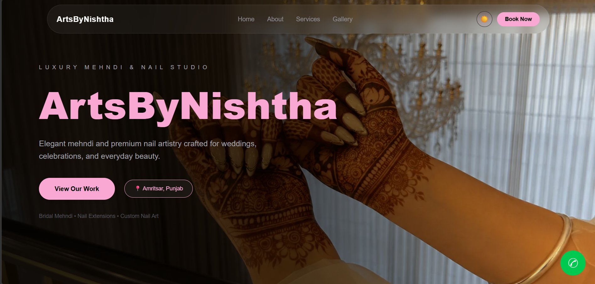
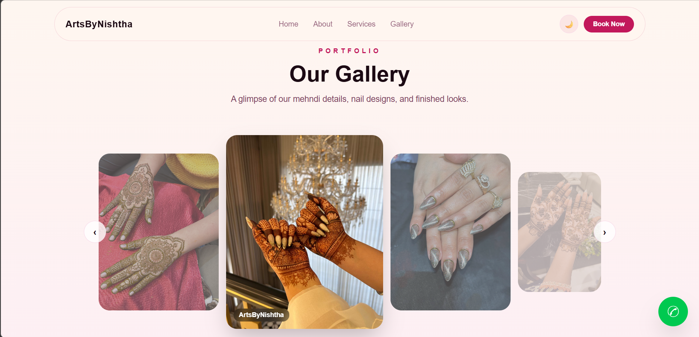
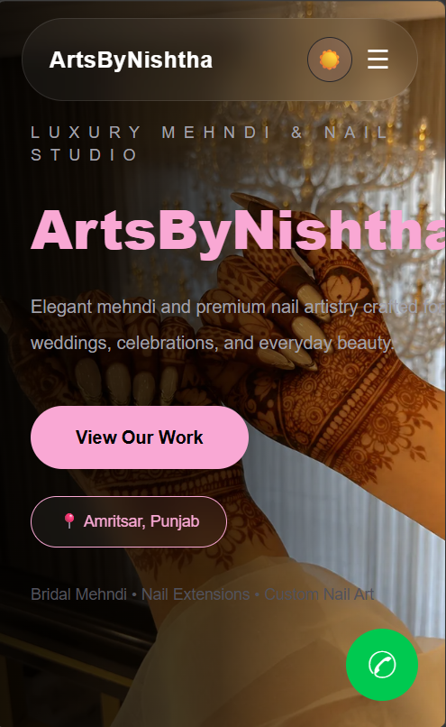

# 🎨 ArtByNishtha — Client Project Showcase

A modern and responsive portfolio website developed for an artist to showcase artwork, creative services, and online presence.

> This is a showcase repository. The source code is private to respect client confidentiality.

## 🌐 Live Website

[View Live Website](https://artsbynishtha.vercel.app/)

## 📸 Screenshots

### Homepage

### Gallery

### Mobile View

## ✨ Features

- Responsive design
- Artwork gallery
- Smooth animations
- Dark and light mode
- Mobile-friendly layout
- Contact and social links

## 🛠 Tech Stack

- React
- Vite
- Tailwind CSS
- Framer Motion

## 📚 What I Learned

While working on this client project, I improved my skills in:

- Building responsive websites
- Creating reusable React components
- Designing clean portfolio layouts
- Working with Tailwind CSS
- Adding smooth animations
- Handling real client requirements

## 🔒 Source Code

The source code for this project is private because it was built for a client.

## 👨‍💻 Developer

**Arman Singh**

MERN Stack Developer  
LinkedIn: https://www.linkedin.com/in/arman-singh-dev/